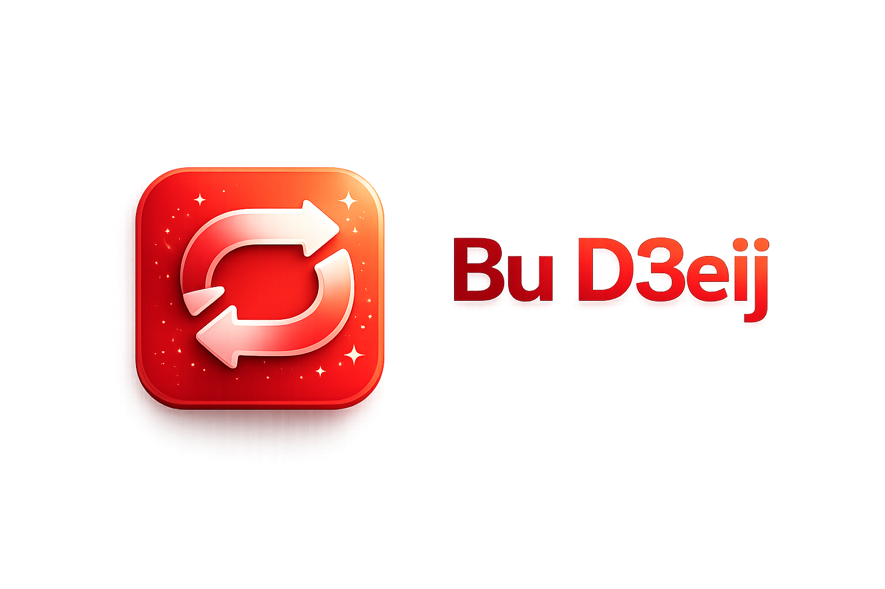

<div align="center">



### Convert anything. Create anything. **On your PC.**

A free, open-source Windows app that converts your documents, images, audio and
video — and adds local AI tools for background removal, upscaling, OCR, stem
splitting and more. **Everything runs on your machine: no accounts, no limits,
nothing uploaded.**

[](LICENSE)
[](#system-requirements)
[](https://github.com/Kha73k/Bu-D3eij/releases/latest)

[**Download for Windows**](https://github.com/Kha73k/Bu-D3eij/releases/latest) ·
[Website](https://bu-d3eij.khalifaarefalhashel.workers.dev) ·
[Changelog](https://bu-d3eij.khalifaarefalhashel.workers.dev/changelog.html)

</div>

---

## Why Bu D3eij

- **100% local & private** — your files never leave your PC.
- **No accounts, no limits** — no sign-ups, no file-size caps, no subscriptions.
- **Free & open-source** — MIT licensed.
- **Install only what you want** — the installer is feature-selective; start light, add more anytime.

## Features

- **Converter** — documents, images, audio & video. Drag, drop, done. Plus a
  multi-file **Batch Convert** and a **YouTube** downloader (MP4 / MP3).
- **Marquee** (image tools) — **Background Remover** (transparent PNG, up to
  hair-strand precision), **Image Upscaler** (to exact 1080p / 2K / 4K),
  **Image → Prompt** (describe a photo as a text-to-image prompt), and **ASCII Art**.
- **Vanguard** (AI text tools) — **AI Text Detector**, **Text Extraction** (offline
  OCR), and **What's The Font** (closest Google-Font matches).
- **Sonara** (audio) — **Stem Splitter**: split any song into vocals / drums / bass /
  other, then mix them live (mute / solo / volume) and save the stems you want.
- **Nexus** (utilities) — offline **currency / unit / time-zone** converters and a
  **QR-code** generator (Wi-Fi, vCard, email, geo, …).
- **Recent** history, a **Clear/Reset** on every tool, light/dark theme, and a
  headless command-line mode.

### Supported conversions

| Category      | Conversions |
|---------------|-------------|
| Documents     | PDF ↔ DOCX, PDF → TXT, PDF → MD, DOCX → TXT, DOCX → PDF, DOCX → MD, TXT → PDF/DOCX/MD |
| Presentations | PPTX → MD, PPTX → PDF, PPTX → TXT |
| Images        | swaps between JPG, PNG, WEBP, BMP, GIF, TIFF |
| Audio/Video   | MP4 → MP3, MP4 → WAV, MP3 → WAV, WAV → MP3 |
| YouTube       | URL → MP4 (best video+audio), URL → MP3 (192 kbps) |

> Markdown (`.md`) is output-only. PowerPoint support is for modern `.pptx`.
> Download only YouTube content you have the right to.

## Download & install

1. Download the latest **`BuD3eij-Setup.exe`** from the
   [Releases page](https://github.com/Kha73k/Bu-D3eij/releases/latest).
2. Run it. The build is **unsigned**, so Windows SmartScreen may say *"Windows
   protected your PC"* — click **More info → Run anyway**.
3. Choose the features you want. The installer sets everything up for you —
   **no Python and no ffmpeg to install yourself**.

The first time you use an AI tool, its model downloads once (then it works
offline). Sizes are listed in [SYSTEM_REQUIREMENTS.md](SYSTEM_REQUIREMENTS.md).

## System requirements

- **Windows 10 (64-bit) or 11**
- 8 GB RAM (16 GB recommended for the AI tools)
- An **NVIDIA GPU is optional** — the AI tools run on it when present and fall
  back to CPU automatically.

Full details + per-feature download sizes: [SYSTEM_REQUIREMENTS.md](SYSTEM_REQUIREMENTS.md).

## Privacy

Bu D3eij is **fully local**. Conversions and AI tools run on your own machine;
your files are never uploaded. The only network use is the one-time download of
an AI model from its open-source host (e.g. Hugging Face) the first time you use
the tool that needs it, and the optional currency-rate refresh. No telemetry, no
accounts, no usage limits.

## Build / run from source (developers)

Requires **Python 3.11**. PyTorch installs from the PyTorch index (CPU by
default; CUDA for NVIDIA GPUs makes the AI tools much faster):

```powershell
py -3.11 -m venv .venv
.\.venv\Scripts\Activate.ps1
pip install -r requirements/torch-cpu.txt    # or torch-cuda.txt for an NVIDIA GPU
pip install -r requirements.txt              # everything (dev install)
python app.py
```

- The dependency split is per-feature — see [requirements/README.md](requirements/README.md).
- ffmpeg auto-downloads on first audio/video use; nothing to install.
- Building the **installer**: [installer/README.md](installer/README.md).
- Architecture / internals: [CLAUDE.md](CLAUDE.md).

### Headless command-line

```powershell
python app.py --convert "photo.png" jpg
python app.py --remove-bg "photo.png"          # transparent PNG
python app.py --upscale "small.png" 2K         # 1080p / 2K / 4K
python app.py --detect "essay.docx"            # AI-likelihood estimate
python app.py --extract-text "shot.png"        # OCR
python app.py --split-stems "song.mp3"         # 4 stem WAVs
python app.py --qr "https://example.com" out.png
# (also: --download, --image-prompt, --ascii, --identify-font, --convert-units/currency/tz)
```

## License & credits

Bu D3eij is licensed under the [MIT License](LICENSE).

It builds on third-party libraries and downloads third-party AI models — see
[THIRD_PARTY.md](THIRD_PARTY.md) for the full list and notices. Two carry extra
terms: **PyMuPDF** (AGPL-3.0, used by the PDF converters) and the **UltraSharp V2**
upscaler models (CC-BY-NC-SA 4.0, non-commercial). Built with
[CustomTkinter](https://github.com/TomSchimansky/CustomTkinter),
[tkinterdnd2](https://github.com/pmgagne/tkinterdnd2), PyTorch, ONNX Runtime, and
many more — thank you to all their authors.
